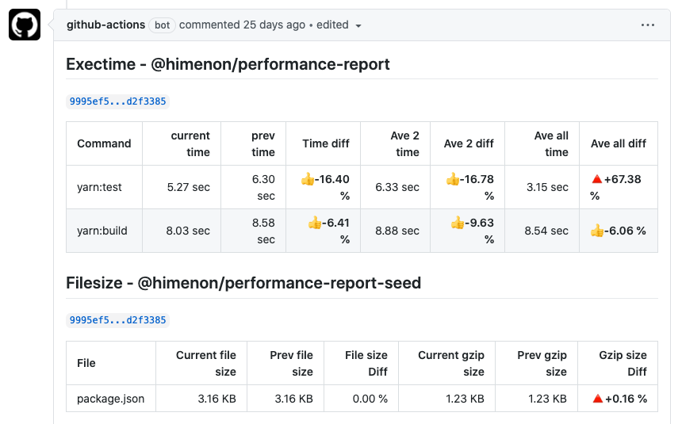

# @himenon/performance-report

Measure the difference in performance.
In addition, Git Repository is used as the save destination of the measurement result.
The currently measurable performance indicators are:

- [x] File size
- [x] Execution time



## Usage

[GitHub Action Sample Code](https://github.com/Himenon/performance-report/blob/main/scripts/tools/check-perf.ts)

```ts
import { EOL } from "os";
import * as path from "path";
import * as PerformanceReport from "../../lib";
import * as GitHubActions from "./actions";
import * as Exectime from "./exectime";
import * as Config from "./config";
import { setEnv, getEnv } from "./env";
const pkg = require("../../package.json");

const generateHideComment = (value: string): string => `<!-- ${value} -->`;

export interface Option {
  isPullRequest: boolean;
  isLocal: boolean;
}

export const createPerformanceReport = async ({ isPullRequest, isLocal }: Option): Promise<void> => {
  if (!isLocal) {
    setEnv({ isPullRequest });
  }
  const { baseRef, datalakeGitHubToken } = getEnv();
  const taskId = isPullRequest ? Config.taskId.pr : Config.taskId.merge;
  const gitHubActions = GitHubActions.create();
  const meta = gitHubActions.generateMeta();

  const option: PerformanceReport.Option = {
    snapshot: {
      minimize: true,
    },
    filesize: {
      applicationRoot: Config.applicationRoot,
    },
    exectime: {
      averageList: [2, "all"],
    },
  };

  const query: PerformanceReport.Filesize.Repository.Query = {
    git: {
      base: {
        ref: baseRef,
      },
    },
  };

  const filesize: PerformanceReport.Filesize.InitialParams = {
    snapshot: {
      filename: path.join(Config.workingDirectory, pkg.name, Config.snapshot.filesize),
      query,
    },
    meta,
    groups: [
      {
        name: `${pkg.name}-seed`,
        version: `${pkg.version}`,
        items: {
          "package.json": {
            absolutePath: path.join(Config.applicationRoot, "package.json"),
          },
        },
      },
      {
        name: `${pkg.name}-cjs`,
        version: `${pkg.version}`,
        items: {
          "$cjs/index.js": {
            absolutePath: path.join(Config.applicationRoot, "lib/$cjs/index.js"),
          },
          "$cjs/exectime.js": {
            absolutePath: path.join(Config.applicationRoot, "lib/$cjs/exectime.js"),
          },
          "$cjs/filesize.js": {
            absolutePath: path.join(Config.applicationRoot, "lib/$cjs/filesize.js"),
          },
        },
      },
      {
        name: `${pkg.name}-esm`,
        version: `${pkg.version}`,
        items: {
          "$esm/index.js": {
            absolutePath: path.join(Config.applicationRoot, "lib/$esm/index.js"),
          },
          "$esm/exectime.js": {
            absolutePath: path.join(Config.applicationRoot, "lib/$esm/exectime.js"),
          },
          "$esm/filesize.js": {
            absolutePath: path.join(Config.applicationRoot, "lib/$esm/filesize.js"),
          },
        },
      },
    ],
  };

  const exectime: PerformanceReport.Exectime.InitialParams = {
    snapshot: {
      filename: path.join(Config.workingDirectory, pkg.name, Config.snapshot.exectime),
      query,
    },
    meta,
    groups: [
      {
        name: pkg.name,
        description: "self repository performance report.",
        measurement: Exectime.generateExectimeMeasure(),
      },
    ],
  };

  const config: PerformanceReport.Config = {
    reporter: {
      filesize,
      exectime,
    },
    git: Config.gitConfig(datalakeGitHubToken),
    applicationRoot: Config.applicationRoot,
    workingDirectory: Config.workingDirectory,
  };

  const report = await PerformanceReport.generate(config, option);

  if (isPullRequest) {
    const text = [report.markdown.exectime, report.markdown.filesize, generateHideComment(taskId)].join(EOL + EOL);
    await gitHubActions.createOrUpdateComment(text, taskId);
  }

  if (!isPullRequest && !isLocal) {
    await report.sync();
  }

  if (!isLocal) {
    report.clearWorkingDirectory();
  }
};
```

## Development

| scripts                   | description                                 |
| :------------------------ | :------------------------------------------ |
| `build`                   | typescript build and create proxy directory |
| `clean`                   | clean up                                    |
| `format:code`             | prettier                                    |
| `format:yarn:lock`        | yarn.lock deduplicate                       |
| `lerna:version:up`        | lerna version up                            |
| `test`                    | execute test:depcruise, test:jest           |
| `test:depcruise`          | dependency-cruiser's test                   |
| `test:jest`               | jest test                                   |
| `ts`                      | execute ts-node                             |
| `release:github:registry` | publish github registry                     |
| `release:npm:registry`    | publish npm registry                        |

## Features

- [Proxy Directory](https://himenon.github.io/docs/javascript/proxy-directory-design-pattern/)

## Release

- Automatic version updates are performed when merged into the `main` branch.

## LICENCE

[@@himenon/performance-report](https://github.com/Himenon/performance-report)・MIT
